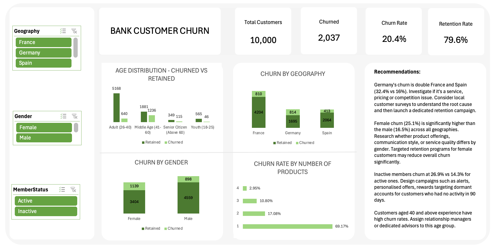

# Bank Customer Churn Analysis

Bank churn analysis of 10000 customers in a bank

## Overview

This project analyzes customer churn behaviour for a bank using a dataset of 10,000 customers. The goal is to identify patterns, key risk segments, and actionable recommendations to reduce the overall churn rate of 20.4%.

---

## Dataset

**File:** `Bank_Churn.csv`  
**Rows:** 10,000 customers  
**Columns:** 13

| Column | Description |
|---|---|
| `CustomerId` | Unique customer identifier |
| `Surname` | Customer surname |
| `CreditScore` | Customer credit score (350–850) |
| `Geography` | Country — France, Germany, or Spain |
| `Gender` | Male or Female |
| `Age` | Customer age |
| `Tenure` | Years with the bank (0–10) |
| `Balance` | Account balance |
| `NumOfProducts` | Number of bank products held (1–4) |
| `HasCrCard` | Whether customer has a credit card (1 = Yes, 0 = No) |
| `IsActiveMember` | Whether customer is active (1 = Yes, 0 = No) |
| `EstimatedSalary` | Estimated annual salary |
| `Exited` | Whether customer churned (1 = Churned, 0 = Retained) |

---

## Key Metrics

| Metric | Value |
|---|---|
| Total customers | 10,000 |
| Churned customers | 2,037 |
| Overall churn rate | 20.4% |
| Retention rate | 79.6% |
| Avg age — churned | 44.8 years |
| Avg age — retained | 37.4 years |
| Avg balance — churned | $91,108 |
| Avg balance — retained | $72,745 |

---

## Key Findings

### Geography
- **Germany** has a churn rate of **32.4%** — double that of France (16.2%) and Spain (16.7%)
- Germany inactive customers churn at **41.1%** — the single highest-risk segment in the dataset

### Gender
- Female customers churn at **25.1%** vs **16.5%** for males
- German females have the highest churn of any gender-geography combination at **37.6%**

### Activity Status
- Inactive members churn at **26.9%** vs **14.3%** for active members
- Calculated as churn rate within each group (not as % of total customers)

### Weak Predictors (low signal)
- **Tenure** — churn is flat across 0–10 years; no loyalty effect
- **Credit card ownership** — cardholders and non-cardholders churn at virtually the same rate

---

## Recommendations

1. **Investigate Germany** — churn is double other markets; conduct local customer surveys to identify the root cause
2. **Re-engage inactive members** — trigger automated outreach after 90 days of inactivity, prioritising Germany and high-balance customers
3. **Protect mid-career, high-balance customers** — churners average age 44.8 with $91K balance; assign relationship managers to customers aged 40–55 with $100K+ balances
4. **Design female-targeted retention offers** — female churn is 25.1% higher than male (16.5%) across all geographies
5. **Deprioritise** credit score, salary, tenure, and credit card as retention levers — data shows minimal impact

---

## Output Files

| File | Description |
|---|---|
| `Bank_Churn.csv` | Original dataset |
| `Bank_Churn.xlsx` | My work |
| `README.md` | This file (Project description) |

---

## KPIs to Track

- Overall churn rate → target: below 15%
- Germany churn rate → target: align with France/Spain (~16%)
- Active member rate → target: above 65% (currently 51.5%)
- Churn rate of high-balance inactive customers → target: below 20%

---

## Tools Used

- **Excel** — data filtering, analysis, and dashboard visualisation

## Acknowledgements

- Data sourced from Maven Analytics